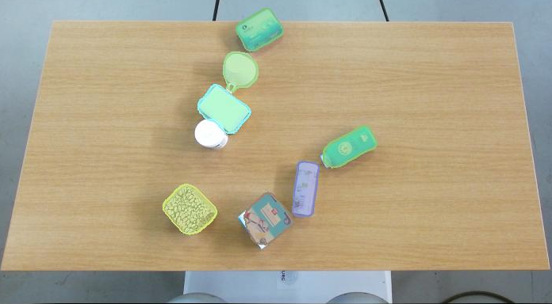

# Self-supervised  Transfer  Learning  for  Instance  Segmentation  through Physical  Interaction
Created by Andreas Eitel at [AIS](http://ais.informatik.uni-freiburg.de/) at University of Freiburg, Germany.

### Introduction
We  present  a  transfer  learning  approach  for  robots that learn to segment objects by interacting with their environment  in  a  self-supervised  manner.  Our  robot  pushes  unknown objects  on  a  table  and  uses  information  from  optical  flow  to create  training  labels  in  the  form  of  object  masks.  To  achieve this,  we  fine-tune  an  existing  DeepMask  network  for  instance segmentation on the self-labeled training data acquired by the robot.  


### Citation

If you find SelfDeepMask useful in your research, please consider citing:
```
@INPROCEEDINGS{eitel19iros,
    author = {Andreas Eitel and Nico Hauff and Wolfram Burgard},
    title = {Self-supervised Transfer Learning for Instance Segmentation through Physical Interaction},
    booktitle = {IEEE/RSJ International Conference on Intelligent Robots and Systems (IROS)},
    year = 2019,
    address = {Macau, China},
    url = {http://ais.informatik.uni-freiburg.de/publications/papers/eitel19iros.pdf}
}
```

### Required environment
All code was tested on a single machine equipped with an NVIDIA Titan X GPU and Ubuntu 18.04.
- Torch7 (For CUDA 10.0 I use the following Torch7 repo (https://github.com/nagadomi/distro))
- CUDA >= 10.0
- Python 3.6.9 (with minor modifications also works on 2.7 ) 
- [Cocoapi] (https://github.com/cocodataset/cocoapi)

### Quick Start

1. Follow the installation instructions of [DeepMask] (https://github.com/facebookresearch/deepmask)..
2. Install [cocoapi](https://github.com/cocodataset/cocoapi)..
3. Download dataset:
```bash
cd self_deepmask; mkdir data; cd data
wget http://robotpush.cs.uni-freiburg.de/dataset/selfdeepmask/train_data.zip
wget http://robotpush.cs.uni-freiburg.de/dataset/selfdeepmask/test_data.zip
unzip train_data.zip
unzip test_data.zip
```
4. Download pre-trained ResNet and Deepmask Model
```bash
cd self_deepmask; mkdir pretrained; cd pretrained
wget https://dl.fbaipublicfiles.com/deepmask/models/resnet-50.t7
mkdir deepmask; cd deepmask
wget https://dl.fbaipublicfiles.com/deepmask/models/deepmask/model.t7
```

5. Start training:
```bash
sh train.sh
```

6. Evaluation using COCO Api:
```bash
sh evaluate.sh
```
7. You can also dowload our trained model
```bash
cd self_deepmask; mkdir trained_models; cd trained_models
wget http://robotpush.cs.uni-freiburg.de/dataset/selfdeepmask/self_deepmask_model.zip; unzip self_deepmask_model.zip
```

## Code for creating self-supervised masks
1. Install python packages
```bash
cd mask_generation
pip install -r requirements.txt
cd pycococreator; pip install -e .
```
2. Mask creation
```bash
mkdir data/train; cd data/train
wget http://robotpush.cs.uni-freiburg.de/dataset/selfdeepmask/robotpush2316.zip; unzip robotpush2316.zip
cd mask_generation; sh create_masks.sh
```
3. Convert to COCO annotations
```bash
cd pycococreator/examples/robotpush/;sh create_train.sh
```
## License
The code related to the mask generation and the dataset are for research purposes. For any commercial purpose, please contact the authors.
This code is partly based on <br/>
[Deepmask](https://github.com/facebookresearch/deepmask) <br/> 
[OpticalFlowToolkit](https://github.com/liruoteng/OpticalFlowToolkit)


Troubleshooting<br/>
Issues to convert instances_train2014.json file to t7?
https://github.com/torch/torch7/issues/1064
https://github.com/torch/torch7/commit/89ede3ba90c906a8ec6b9a0f4bef188ba5bb2fd8
